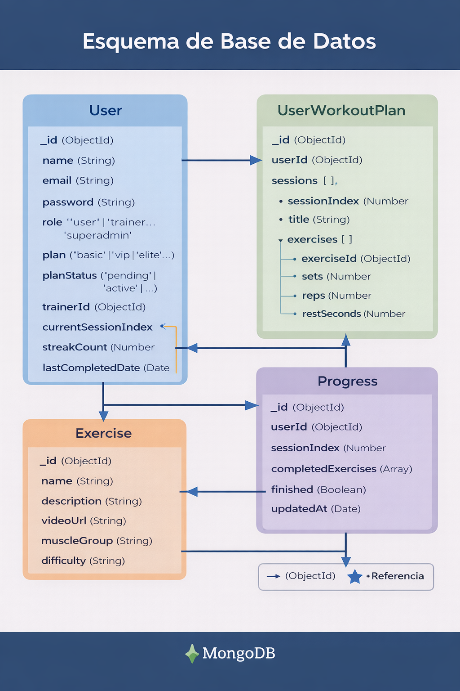

# 📱 Satori App 

Aplicación móvil de entrenamiento personalizado desarrollada con Flutter (frontend) y Node.js + MongoDB (backend).

Permite a los usuarios:
- Registrarse
- Seleccionar plan
- Acceder a su entrenamiento personalizado
- Seguir su progreso por sesión

## 🏗️ Arquitectura

Frontend:
- Flutter

Backend:
- Node.js
- Express
- MongoDB

Estructura principal:

User → Información del usuario y rol  
Exercise → Catálogo global de ejercicios  
UserWorkoutPlan → Plan personalizado por usuario  
Progress → Seguimiento de sesión actual  

## 🗄️ Esquema de Base de Datos

Incluye panel administrativo para entrenadores.

## 📬 Esquema para hacer pruebas con Postman:

### Crear usuario ➕ ->

localhost:3000/usuarios

{
    "name": "Carlos Roberto",
    "email":"crdq17@hotmail.com",
    "password":"1234",
    "role":"usuario",
    "plan":"basico",
    "planStatus":"activo",
    "trainerId":"1",
    "currentSessionIndex":"",
    "streakCount":"",
    "lasCompletedDate":""
}

### Leer Usuarios 📖 ->

localhost:3000/usuarios

### Leer un solo Usuario 👀 ->

localhost:3000/usuarios/2

### Acutaliza Usuario ✏️ ->

localhost:3000/usuarios/1

{
    "name": "CarlosR.",
    "email":"crdq17@hotmail.com",
    "password":"1234",
    "role":"usuario",
    "plan":"basico",
    "planStatus":"activo",
    "trainerId":"1",
    "currentSessionIndex":"",
    "streakCount":"",
    "lasCompletedDate":""
}

### Borrar Usuarios 🗑️ ->

localhost:3000/usuarios/1
